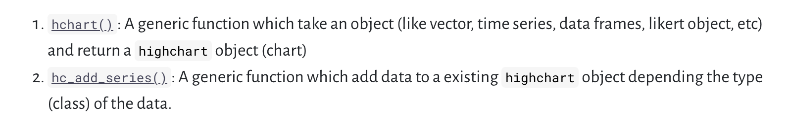
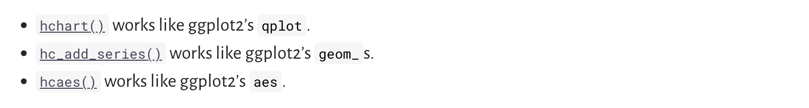

```{r setup, include=FALSE,warning=FALSE,message=FALSE}
knitr::opts_chunk$set(echo = FALSE)
# "... for your boss... and also probably PMs, POs, SMEs, directors, friends, neighbors, whatever--but mainly *FOR YOURSELF*"
     #   logo:  "onica_amazon_small.png"

library(readr)
library(dplyr)
library(readr)

library(highcharter)
library(tidyverse)
library(lubridate)
library(DT)
library(summarytools)


```

```{css}
.gdbar img {
  width: 253px !important;
  height: 79px !important;
  margin: 8px 8px;
}

.gdbar {
  width: 400px !important;
  height: 95px !important;
}
.footer {
    position: fixed;
    left: 0;
    bottom: 0;
    width: 100%;
    margin: 5px;
   
    text-align: right;
}
slides > slide:not(.nobackground):before {
  width: 75px;
  height: 25px;
  background-size: 75px 25px;
}


```

# What & Why?

## What is it

> - An R wrapper for the beloved JavaScript Highcharts library

> - Pretty and versatile: bars, maps, bubbles, heatmaps, density, timeseries, and so on

> - Interactive: many plots in one

> - syntactically similar to ggplot2

## Why you'll like it

>  - Same reasons: pretty, versatile, interactive, not even hard.

>    - Interactive plots *save you time*.
>   + <h6>No more labeling bar heights</h6>
>   + <h6>Include context without clutter via hover box</h6>
>   + <h6>No more plotting every combination of comparison groups (simply click to show/hide groups)</h6>
>   + <h6>Allow for x and y zooms (especially useful for timeseries) </h6>


> - People will respect you


> -  *You get to use R*


## Why you should use it

## Why you should use it

</br>
</br>

<h2>There is a war on R and it's time to show off.</h2>


</br>
</br>


## Why you should use it 

</br>
</br>

<h2>There is a war on R and it's time to show off.</h2>


</br>
</br>


<h2>We cannot let the python bros win.  </h2>


## But seriously... 

> - highcharter *makes R look good*.  **Dress your data to impress.**

> - We *all* benefit when you make R look good. 
>   + <h6> Your company will keep hiring R users (they don't see the code, they see the output)</h6>
>   + <h6>More people will want to learn R</h6>

> - People expect fancy viz now.
>   + <h6>The world is digital (don't make print plots for digital viewing)</h6>
>   + <h6>Gamification, leader boards, etc. raised viz expectations for non-tech people</h6>

> - You can justify R in a sea of Python users
>   + <h6>You can use my line: "R is for research, Python is for production."</h6>

> - Again, we cannot let the python bros win.
>     + <h6>If we lose the viz battle I'm becoming an interior decorator.</h6>


# Highcharter: from + to %>%

A guided tour

## Basics


```{r,out.width = "800px"}

```

## Basics


```{r,out.width = "800px"}

```

```{r,out.width = "800px"}

```


## We covered


- group by

- stacked/dodge

- legends

- markers

- title, subtitle, x and y labs

- opacity

- "invisible" plots

- custom hover text

- multiple series

- conditional line attributes


