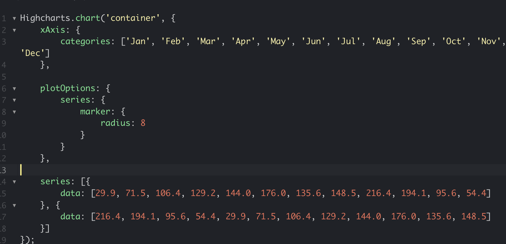

```{r setup, include=FALSE, message=FALSE, warning=FALSE}
#knitr::opts_chunk$set(echo = TRUE) 
library(flexdashboard) # dashboards!
library(highcharter)   # for interactive plots
library(DT)            # for search/filter/downloadable tables
library(tidyverse)     # doi
options(scipen=999)    # keep scientific notation turned off
```


<div class="footer">
  <p> NYR 2022 | Malorie Hughes | maloriejhughes@gmail.com | github.com/maloriejhughes </p>
</div>
  


Bars and Columns
================================


Row {data-height=110,echo=TRUE}
-------------------------------------

### Data 

```{r,echo=TRUE}

data(diamonds)
data <- subset(diamonds, color %in% c("E", "F", "G") & cut %in% c("Ideal", "Premium", "Good"))
data$indicator <- ifelse(data$color %in% c("G" ), 1, 0)
```


Row {data-height=50}
-------------------------------------

<h3> 1. GROUPED BAR PLOT (DODGE) </h3>


Row {data-height=200}
-------------------------------------
### ggplot2 

```{r, message=FALSE,eval=FALSE,echo=TRUE}
 ggplot(data) +
  geom_bar(aes(color, fill=cut), position="dodge", width=.4) +
  ggtitle("Another interesting title") +
  xlab("Cut") + ylab("Amount")
 

```


### highcharter

```{r, message=FALSE,eval=FALSE,echo=TRUE}

dat_sum <-data %>% group_by(color,cut) %>%summarise(tot=n())

highchart() %>%
  hc_add_series(dat_sum , type="column", hcaes(color,tot,group=cut))  %>%
  hc_title(text="Another interesting title")%>%
  hc_xAxis(type="category", title=list(text="Cut")) 

```


Row {data-height=500}
-------------------------------------

### ggplot2 

```{r, message=FALSE}
 ggplot(data) +
  geom_bar(aes(color, fill=cut), position="dodge", width=.4) +
  ggtitle("Another interesting title") +
  xlab("Cut") + ylab("Amount")
 

```

### highcharter

```{r, message=FALSE}

dat_sum <-data %>% group_by(color,cut) %>%summarise(tot=n())

highchart() %>%
  hc_add_series(dat_sum , type="column", hcaes(color,tot,group=cut))  %>%
  hc_title(text="Another interesting title")%>%
  hc_xAxis(type="category", title=list(text="Cut")) #%>%

```

Row {data-height=50}
-------------------------------------

Note: aesthetics can be defined for the various features that compose each component/layer. This core difference results in the regular use of list(). There are many features of an x-axis, each have multiple modifiable attributes, hence we need title=list(...) to modify attributes of the plot title.


Row {data-height=500, data-width=600}
-------------------------------------

```{r, message=FALSE}
library(printr)
details1<-read_csv('extras/example1.csv')
details1%>%filter(id==1)%>% select(!c(id, example))%>%
  datatable(class = "compact",options = list(
    bPaginate = FALSE,dom = 't'), rownames=FALSE) 

```


Row {data-height=50}
-------------------------------------

<h3> 2. GROUPED BAR PLOT (STACKED) </h3>


Row {data-height=200}
-------------------------------------
 
### ggplot2

```{r, message=FALSE,eval=FALSE,echo=TRUE}
 ggplot(data) +
  geom_bar(aes(color, fill=cut), position="stack") +                                       
  ggtitle("Another interesting title") +
  xlab("Cut") + ylab("Amount")
 

```

### highcharter

```{r, message=FALSE,eval=FALSE,echo=TRUE}

dat_sum <-data %>% group_by(color,cut) %>%summarise(tot=n())

highchart() %>%
  hc_add_series(dat_sum , type="column", hcaes(color,tot,group=cut), stacking = "normal")  %>%
  hc_title(text="Another interesting title")%>%
  hc_xAxis(type="category", title=list(text="Cut")) 

```


Row {data-height=500}
-------------------------------------
### ggplot2 

```{r, message=FALSE}
 ggplot(data) +
  geom_bar(aes(color, fill=cut), position="stack") +
  ggtitle("Another interesting title") +
  xlab("Cut") + ylab("Amount")
 

```


### highcharter

```{r, message=FALSE}

dat_sum <-data %>% group_by(color,cut) %>%summarise(tot=n())

highchart() %>%
  hc_add_series(dat_sum , type="column", hcaes(color,tot,group=cut) , stacking = "normal")  %>%
  hc_title(text="Another interesting title")%>%
  hc_xAxis(type="category", title=list(text="Cut")) 

```


Row {data-height=500, data-width=600}
-------------------------------------

```{r, message=FALSE}

details1%>%filter(id==2)%>%select(!c(id, example))%>%
  datatable(class = "compact",options = list(
    bPaginate = FALSE,dom = 't'), rownames=FALSE) 

```


Row {data-height=50}
-------------------------------------

<h3> 3. MOVE THE HIGHCHART LEGEND  </h3>


Row {data-height=250}
-------------------------------------
### ggplot2 

```{r, message=FALSE,eval=FALSE,echo=TRUE}
 ggplot(data) +
  geom_bar(aes(color, fill=cut), position="stack") +
  ggtitle("Another interesting title") +
  xlab("Cut") + ylab("Amount")
 

```


### highcharter

```{r, message=FALSE,eval=FALSE,echo=TRUE}

dat_sum <-data %>% group_by(color,cut) %>%summarise(tot=n())

highchart() %>%
  hc_add_series(dat_sum , type="column", hcaes(color,tot,group=cut), stacking = "normal")  %>%
  hc_title(text="Another interesting title")%>%
  hc_xAxis(type="category", title=list(text="Cut")) %>%
  hc_legend( align = "right"
          ,  verticalAlign = "middle"
          ,  layout = "vertical" )

```


Row {data-height=500}
-------------------------------------
### ggplot2 

```{r, message=FALSE}
 ggplot(data) +
  geom_bar(aes(color, fill=cut), position="stack") +
  ggtitle("Another interesting title") +
  xlab("Cut") + ylab("Amount")
 

```


### highcharter

```{r, message=FALSE}

dat_sum <-data %>% group_by(color,cut) %>%summarise(tot=n())

highchart() %>%
  hc_add_series(dat_sum , type="column", hcaes(color,tot,group=cut) , stacking = "normal")  %>%
  hc_title(text="Another interesting title")%>%
  hc_xAxis(type="category", title=list(text="Cut"))%>%
  hc_legend( align = "right"
          ,  verticalAlign = "middle"
          ,  layout = "vertical" )

```


Row {data-height=500, data-width=600}
-------------------------------------

```{r}

```

```{r, message=FALSE}

details1%>%filter(id==3)%>%select(!c(id, example))%>%
  datatable(class = "compact",options = list(
    bPaginate = FALSE,dom = 't'), rownames=FALSE) 

```


Row {data-height=50}
-------------------------------------


<h3> 4. FILL OPACITY </h3>


Row {data-height=250}
-------------------------------------

### highcharter

```{r, message=FALSE,eval=FALSE,echo=TRUE}

dat_sum <-data %>% group_by(color,cut) %>%summarise(tot=n())

highchart() %>%
  hc_add_series(dat_sum , type="column", hcaes(color,tot,group=cut), opacity=.75)  %>%
  hc_title(text="Another interesting title")%>%
  hc_xAxis(type="category", title=list(text="Cut")) # or you can do: %>%
#                                                                     hc_plotOptions( column = list( opacity = .75 ) )
```


Row {data-height=500}
-------------------------------------

### highcharter

```{r, message=FALSE}

dat_sum <-data %>% group_by(color,cut) %>%summarise(tot=n())

highchart() %>%
  hc_add_series(dat_sum , type="column", hcaes(color,tot,group=cut) ,opacity=.75)  %>%
  hc_title(text="Another interesting title")%>%
  hc_xAxis(type="category", title=list(text="Cut"))
 

```
Row {data-height=500, data-width=600}
-------------------------------------

```{r, message=FALSE}

details1%>%filter(id==4)%>%select(!c(id, example))%>%
  datatable(class = "compact",options = list(
    bPaginate = FALSE,dom = 't'), rownames=FALSE) 

```


Lines
================================


Row 
-------------------------------------

### Data

```{r,echo=TRUE}

data("Grunfeld", package = "plm")
head(Grunfeld)

```


Row {data-height=50}
-------------------------------------

<h3> 1.  MARKERS  </h3>


Row {data-height=100}
-------------------------------------

### big markers
```{r,echo=TRUE,eval=FALSE}

hchart(Grunfeld, "line", hcaes(x = year, y = value, group = firm))

```

### no markers (radius = 0)

```{r,echo=TRUE,eval=FALSE}
hchart(Grunfeld, "line", hcaes(x = year, y = value, group = firm)) %>%
  hc_plotOptions(line=list(marker=list(radius=0)))

```


Row {data-height=600}
-------------------------------------
### big markers
```{r}

hchart(Grunfeld, "line", hcaes(x = year, y = value, group = firm))

```

### no markers (radius = 0)

```{r}
hchart(Grunfeld, "line", hcaes(x = year, y = value, group = firm)) %>%
  hc_plotOptions(line=list(marker=list(radius=0)))

```


Row 
-------------------------------------

### Note: 
You will find it more challenging to google examples for the R highcharter package than for the original javascript highcharts library.
</br>

From the jsfiddle javascript highcharts documentation (https://jsfiddle.net/gh/get/library/pure/highcharts
)

</br>

Row 
-------------------------------------

{width=50%}
{width=20%}
{width=17%}


Row {data-height=50}
-------------------------------------

<h3> 2.  FACILITATE MANY COMPARISONS  </h3>


Row {data-height=200}
-------------------------------------


### FACILITATE MANY COMPARISONS

```{r,echo=TRUE, eval=FALSE}
hchart(Grunfeld, "line", hcaes(x = year, y = value, group = firm), visible = FALSE) %>%
  hc_plotOptions( 
    series = list( 
         marker = list( 
            radius=3 
            ) 
         ) 
    )

```

Row {data-height=600}
-------------------------------------


### FACILITATE MANY COMPARISONS

```{r}
hchart(Grunfeld, "line", hcaes(x = year, y = value, group = firm), visible=FALSE) %>%
  hc_plotOptions(line=list(marker=list(radius=3))) %>% 
  hc_title(text='So many plots in one!')%>%
  hc_subtitle(text='With visible=FALSE')

```


Row {data-height=50}
-------------------------------------

<h3> 3.  CUSTOM HOVER TEXT!  </h3>


Row {data-height=500}
-------------------------------------


### CUSTOM HOVER TEXT!


```{r,echo=TRUE, eval=FALSE}

#####  what do you want to name the values
x <- c("Firm ID","Firm Value", "Capital", "Gross Investment")  

#####  column names of the values & formatting to cut off numerics at 2 decimal places
y <- sprintf("{point.%s:.2f}", c("firm", "value", "capital", "inv"))   

#####  creates the tooltip
tltip <- tooltip_table(x, y)                              

### to keep the firm ID from displaying with decimal points
Grunfeld<- Grunfeld %>% mutate(firm=as.character(firm))

hchart(Grunfeld, "line", hcaes(x = year, y = value, group = firm)) %>%
  hc_plotOptions( line = list( marker = list( radius=3 ) ) ) %>%
  ##### use the tooltip
  hc_tooltip(useHTML = TRUE, pointFormat = tltip)     
```


Row {data-height=600}
-------------------------------------


### CUSTOM HOVER TEXT!


```{r}

#####  what do you want to name the values
x <- c("Firm ID","Firm Value", "Capital", "Gross Investment")  

#####  column names of the values & formatting to cut off numerics at 2 decimal places
y <- sprintf("{point.%s:.2f}", c("firm", "value", "capital", "inv"))   

#####  creates the tooltip
tltip <- tooltip_table(x, y)                              

### to keep the firm ID from displaying with decimal points
Grunfeld<- Grunfeld %>% mutate(firm=as.character(firm))


hchart(Grunfeld, "line", hcaes(x = year, y = value, group = firm)) %>%
  hc_plotOptions( line = list( marker = list( radius=3 ) ) ) %>%
  ##### use the tooltip
  hc_tooltip(useHTML = TRUE, pointFormat = tltip)     


```


Get Fancy
================================


Row {data-height=750}
-------------------------------------
  
  
### The data 
  
```{r,message=FALSE, warning=FALSE, echo=TRUE}
holdout<- read_csv("model_progression.csv")
holdout<- holdout%>%select(!c(Group,Dataset))

# add numbers to the Method names
holdout<- holdout %>% mutate(x_label=paste0(row_number()-1,": ",Method))
datatable(holdout,  class = "compact",options = list(pageLength = 18))
```


Row
-------------------------------------
  
  
### first observation is the baseline model performance
```{r,message=FALSE, warning=FALSE,echo=TRUE}

recall_baseline<-holdout$Recall[1]
precision_baseline<- holdout$Precision[1]
holdout <- holdout[-1,]

recall_baseline
precision_baseline
```


Row {data-height=750}
-------------------------------------
  
### Here's where we're headed:
```{r, echo=FALSE}
performance_threshold_dash= 'shortdashdot'
precision_color='maroon'
recall_color= 'slateblue'

below_baseline_color='lightgrey'
above_goal_color='green'

highchart() %>%
  hc_add_series(holdout, "line", hcaes(x_label,Precision)
                , name="Precision" , color=precision_color 
                # conditional line coloring: let the line plot change colors and dash style based on y-values
                , zones=list(  
                  list( value = precision_baseline , color= below_baseline_color)
                  ,  list( value = 0.8  , color = precision_color )
                  ,  list( value = 1.01 , color = above_goal_color , dashStyle='shortdashdot' , dashWidth=3 )
                ) 
  ) %>% 
  
  
  hc_add_series(holdout, "line",  hcaes(x_label,Recall)  
                ,  name="Recall"  , color=recall_color
                ,  zones=list(
                  list(value=recall_baseline,color= below_baseline_color)
                  , list(value = 0.8,color = recall_color)
                  , list(value = 1.01,color = above_goal_color ) )
  )%>% 
  hc_xAxis(type="category") %>%   
  hc_yAxis( max=1 )%>% 
  
  hc_yAxis(plotLines = list(
    
    list(label = list(text = "Recall Baseline"),
         color = "slateblue",
         width = 1.75,
         dashStyle= performance_threshold_dash,
         value = recall_baseline)
    
    , list(label = list(text = "Precision Baseline", y=13),
           color = "maroon", 
           width = 2,
           dashStyle= performance_threshold_dash,
           value = precision_baseline)
    , list(label = list(text = "GOAL"),
           color = above_goal_color , 
           width = 2.25,
           dashStyle= performance_threshold_dash,
           value = 0.8)
    
    
  ))%>%    
  hc_legend(align = "right", verticalAlign = "top", layout = "vertical") %>% 
  hc_size(height=700)%>%
  hc_title(text="Precision/Recall Tradeoff") %>% hc_subtitle(text="ML Classification Model Progression")

```


Row {data-height=50}
-------------------------------------

<h3> 1.  LINE COLOR, SUBTITLE  </h3>


Row {data-height=300}
-------------------------------------

### LINE COLOR, SUBTITLE

```{r, message=FALSE , warning=FALSE , echo = TRUE ,eval=FALSE}
precision_color='maroon'

highchart() %>%
  hc_add_series( holdout, "line", hcaes( x_label , Precision)
                ,    color = precision_color 
                
  ) %>% 
  hc_legend(align = "right", verticalAlign = "top", layout = "vertical") %>%
  hc_size(700)%>%
  hc_title(text = "Precision/Recall Tradeoff") %>% 
  hc_subtitle(text = "ML Classification Model Progression" )
```
Row {data-height=750}
-------------------------------------

### LINE COLOR, SUBTITLE

```{r, message=FALSE , warning=FALSE , echo = FALSE}
precision_color='maroon'

highchart() %>%
  hc_add_series( holdout, "line", hcaes( x_label , Precision)
                ,    color = precision_color 
                
  ) %>% 
  hc_legend(align = "right", verticalAlign = "top", layout = "vertical") %>%
  hc_size(700)%>%
  hc_title(text = "Precision/Recall Tradeoff") %>% 
  hc_subtitle(text = "ML Classification Model Progression" )
```


Row {data-height=50}
-------------------------------------

<h3> 2. MULTIPLE SERIES,  SERIES NAMES, X-AXIS LABELS </h3>


Row {data-height=500}
-------------------------------------

### MULTIPLE SERIES,  SERIES NAMES, X-AXIS LABELS
```{r, message=FALSE , warning=FALSE , echo = TRUE, eval=FALSE }
precision_color='maroon'
recall_color= 'slateblue'

highchart() %>%
  hc_add_series( holdout, "line", hcaes( x_label , Precision)  
                ,    color = precision_color 
                ,    name = "Precision" 
                
  ) %>% 
  
 hc_add_series(holdout, "line",  hcaes( x_label , Recall)     
                ,    color = recall_color
                ,    name="Recall"
  ) %>% 
  
  hc_legend(align = "right", verticalAlign = "top", layout = "vertical") %>%
  hc_size(700)%>%
  hc_title(text = "Precision/Recall Tradeoff") %>% 
  hc_subtitle(text = "ML Classification Model Progression" ) %>%
  hc_xAxis(type="category") # so the characters aren't converted to numeric
```


Row {data-height=750}
-------------------------------------

### MULTIPLE SERIES,  SERIES NAMES, X-AXIS LABELS
```{r, message=FALSE , warning=FALSE , echo = FALSE }
precision_color='maroon'
recall_color= 'slateblue'

highchart() %>%
  hc_add_series( holdout, "line", hcaes( x_label , Precision)  
                ,    color = precision_color 
                ,    name = "Precision" 
                
  ) %>% 
  
 hc_add_series(holdout, "line",  hcaes( x_label , Recall)     
                ,    color = recall_color
                ,    name="Recall"
  ) %>% 
  
  hc_legend(align = "right", verticalAlign = "top", layout = "vertical") %>%
  hc_size(700)%>%
  hc_title(text = "Precision/Recall Tradeoff") %>% 
  hc_subtitle(text = "ML Classification Model Progression" ) %>%
  hc_xAxis(type="category") # so the characters aren't converted to numeric
```


Row {data-height=50}
-------------------------------------

<h3> 3.CONDITIONAL LINE COLORS </h3>


Row {data-height=800}
-------------------------------------

### 3. CONDITIONAL LINE COLORS
```{r, message=FALSE , warning=FALSE , echo = TRUE, eval=FALSE }
precision_color='maroon'
recall_color= 'slateblue'

below_baseline_color='lightgrey'
above_goal_color='green'

recall_goal = 0.8
precision_goal = 0.8

highchart() %>%
  hc_add_series( holdout, "line", hcaes( x_label , Precision)  
                ,    color = precision_color 
                ,    name = "Precision" 
# conditional line attributes: defining v-value * zones *. 
# set the line attributes for values <= some chosen threshold:
               ,    zones = list(  
                        list( value = precision_baseline , color = below_baseline_color )
                     ,  list( value = precision_goal     , color = precision_color )
                     ,  list( value = 1.01               , color = above_goal_color 
# celebrate meeting the performance goal with some festive dashes
                            , dashStyle='shortdashdot' , dashWidth=3 )
                      ) 
  ) %>% 
 hc_add_series(holdout, "line",  hcaes( x_label , Recall)     
                ,    color = recall_color
                ,    name = "Recall"
                ,    zones=list(
                        list(value=recall_baseline , color = below_baseline_color )
                      , list(value = recall_goal   , color = recall_color )
                      , list(value = 1.01          , color = above_goal_color 
                           , dashStyle='shortdashdot' , dashWidth=3 ) 
                      )
  ) %>% 

  hc_legend(align = "right", verticalAlign = "top", layout = "vertical") %>%
   hc_size(700)%>%
  hc_title(text = "Precision/Recall Tradeoff") %>% 
  hc_subtitle(text = "ML Classification Model Progression" ) %>%
  hc_xAxis(type="category") 
```


Row {data-height=750}
-------------------------------------

### 3. CONDITIONAL LINE COLORS
```{r, message=FALSE , warning=FALSE , echo = FALSE }
precision_color='maroon'
recall_color= 'slateblue'

below_baseline_color='lightgrey'
above_goal_color='green'

recall_goal = 0.8
precision_goal = 0.8

highchart() %>%
  hc_add_series( holdout, "line", hcaes( x_label , Precision)  
                ,    color = precision_color 
                ,    name = "Precision" 
# conditional line attributes: defining v-value * zones *. 
# set the line attributes for values <= some chosen threshold:
               ,    zones = list(  
                        list( value = precision_baseline , color = below_baseline_color )
                     ,  list( value = precision_goal     , color = precision_color )
                     ,  list( value = 1.01               , color = above_goal_color 
# celebrate meeting the performance goal with some festive dashes
                            , dashStyle='shortdashdot' , dashWidth=3 )
                      ) 
  ) %>% 
 hc_add_series(holdout, "line",  hcaes( x_label , Recall)     
                ,    color = recall_color
                ,    name = "Recall"
                ,    zones=list(
                        list(value=recall_baseline , color = below_baseline_color )
                      , list(value = recall_goal   , color = recall_color )
                      , list(value = 1.01          , color = above_goal_color 
                           , dashStyle='shortdashdot' , dashWidth=3 ) 
                      )
  ) %>% 

  hc_legend(align = "right", verticalAlign = "top", layout = "vertical") %>%
   hc_size(700)%>%
  hc_title(text = "Precision/Recall Tradeoff") %>% 
  hc_subtitle(text = "ML Classification Model Progression" ) %>%
  hc_xAxis(type="category") 
```


Row {data-height=50}
-------------------------------------

<h3> 4. HORIZONTAL PLOT LINES </h3>


Row {data-height=900}
-------------------------------------

### 4. HORIZONTAL PLOT LINES
```{r, message=FALSE , warning=FALSE , echo = TRUE, eval=FALSE }
precision_color='maroon'
recall_color= 'slateblue'
below_baseline_color='lightgrey'
above_goal_color='green'
recall_goal = 0.8
precision_goal = 0.8
  
highchart() %>%
  hc_add_series( holdout, "line", hcaes( x_label , Precision)  
                ,    color = precision_color 
                ,    name = "Precision" 
                ,    zones = list(  
                        list( value = precision_baseline , color = below_baseline_color )
                     ,  list( value = precision_goal     , color = precision_color )
                     ,  list( value = 1.01               , color = above_goal_color 
                            , dashStyle='shortdashdot' , dashWidth=3 )
                      ) 
  ) %>% 
 hc_add_series(holdout, "line",  hcaes( x_label , Recall)     
                ,    color = recall_color
                ,    name = "Recall"
                ,    zones=list(
                        list(value=recall_baseline , color = below_baseline_color )
                      , list(value = recall_goal   , color = recall_color )
                      , list(value = 1.01          , color = above_goal_color 
                           , dashStyle='shortdashdot' , dashWidth=3 ) 
                      )
  ) %>% 
  
  hc_yAxis(plotLines = list(
    list(  value = recall_baseline
         , label = list(text = "Recall Baseline")
         , color = recall_color
         , width = 1.75
         , dashStyle= performance_threshold_dash)
  )) %>%
  
  hc_legend(align = "right", verticalAlign = "top", layout = "vertical") %>%
   hc_size(400)%>%
  hc_title(text = "Precision/Recall Tradeoff") %>% 
  hc_subtitle(text = "ML Classification Model Progression" ) %>%
  hc_xAxis(type="category") 
```


Row {data-height=750}
-------------------------------------

### 4. HORIZONTAL PLOT LINES
```{r, message=FALSE , warning=FALSE}
precision_color='maroon'
recall_color= 'slateblue'
below_baseline_color='lightgrey'
above_goal_color='green'
recall_goal = 0.8
precision_goal = 0.8
  
highchart() %>%
  hc_add_series( holdout, "line", hcaes( x_label , Precision)  
                ,    color = precision_color 
                ,    name = "Precision" 
                ,    zones = list(  
                        list( value = precision_baseline , color = below_baseline_color )
                     ,  list( value = precision_goal     , color = precision_color )
                     ,  list( value = 1.01               , color = above_goal_color 
                            , dashStyle='shortdashdot' , dashWidth=3 )
                      ) 
  ) %>% 
 hc_add_series(holdout, "line",  hcaes( x_label , Recall)     
                ,    color = recall_color
                ,    name = "Recall"
                ,    zones=list(
                        list(value=recall_baseline , color = below_baseline_color )
                      , list(value = recall_goal   , color = recall_color )
                      , list(value = 1.01          , color = above_goal_color 
                           , dashStyle='shortdashdot' , dashWidth=3 ) 
                      )
  ) %>% 
  
  hc_yAxis(plotLines = list(
    list(  value = recall_baseline
         , label = list(text = "Recall Baseline")
         , color = recall_color
         , width = 1.75
         , dashStyle= performance_threshold_dash)
  )) %>%
  
  hc_legend(align = "right", verticalAlign = "top", layout = "vertical") %>%
   hc_size(700)%>%
  hc_title(text = "Precision/Recall Tradeoff") %>% 
  hc_subtitle(text = "ML Classification Model Progression" ) %>%
  hc_xAxis(type="category") 
```


Row {data-height=50}
-------------------------------------

<h3> 5. ADD THE OTHER LINES </h3>


Row {data-height=1200}
-------------------------------------

### 5. ADD THE OTHER LINES
```{r, message=FALSE , warning=FALSE , eval=FALSE, echo = TRUE }
precision_color='maroon'
recall_color= 'slateblue'
below_baseline_color='lightgrey'
above_goal_color='green'
recall_goal = 0.8
precision_goal = 0.8
  
highchart() %>%
  hc_add_series( holdout, "line", hcaes( x_label , Precision)  
                ,    color = precision_color 
                ,    name = "Precision" 
                ,    zones = list(  
                        list( value = precision_baseline , color = below_baseline_color )
                     ,  list( value = precision_goal     , color = precision_color )
                     ,  list( value = 1.01               , color = above_goal_color 
                            , dashStyle='shortdashdot' , dashWidth=3 )
                      ) 
  ) %>% 
 hc_add_series(holdout, "line",  hcaes( x_label , Recall)     
                ,    color = recall_color
                ,    name = "Recall"
                ,    zones=list(
                        list(value=recall_baseline , color = below_baseline_color )
                      , list(value = recall_goal   , color = recall_color )
                      , list(value = 1.01          , color = above_goal_color 
                           , dashStyle='shortdashdot' , dashWidth=3 ) 
                      )
  ) %>% 
  hc_yAxis(plotLines = list(
    list(  value = recall_baseline
         , label = list(text = "Recall Baseline")
         , color = recall_color
         , width = 1.75
         , dashStyle= performance_threshold_dash )
    
  , list(  value = precision_baseline
         , label = list(text = "Precision Baseline", y=13)
         , color = precision_color
         , width = 2
         , dashStyle= performance_threshold_dash )
  
    , list(value = precision_goal
         , label = list( text = "GOAL")
         , color = above_goal_color 
         , width = 2.25
         , dashStyle= performance_threshold_dash )
  )
  , min=0, max=1) %>%
  
  hc_legend(align = "right", verticalAlign = "top", layout = "vertical") %>%
  hc_size(700)%>%
  hc_title(text = "Precision/Recall Tradeoff") %>% 
  hc_subtitle(text = "ML Classification Model Progression" ) %>%
  hc_xAxis(type="category") 
```


Row {data-height=750}
-------------------------------------

### 5. ADD THE OTHER LINES
```{r, message=FALSE , warning=FALSE,echo = FALSE }
precision_color='maroon'
recall_color= 'slateblue'
below_baseline_color='lightgrey'
above_goal_color='green'
recall_goal = 0.8
precision_goal = 0.8
  
highchart() %>%
  hc_add_series( holdout, "line", hcaes( x_label , Precision)  
                ,    color = precision_color 
                ,    name = "Precision" 
                ,    zones = list(  
                        list( value = precision_baseline , color = below_baseline_color )
                     ,  list( value = precision_goal     , color = precision_color )
                     ,  list( value = 1.01               , color = above_goal_color 
                            , dashStyle='shortdashdot' , dashWidth=3 )
                      ) 
  ) %>% 
 hc_add_series(holdout, "line",  hcaes( x_label , Recall)     
                ,    color = recall_color
                ,    name = "Recall"
                ,    zones=list(
                        list(value=recall_baseline , color = below_baseline_color )
                      , list(value = recall_goal   , color = recall_color )
                      , list(value = 1.01          , color = above_goal_color 
                           , dashStyle='shortdashdot' , dashWidth=3 ) 
                      )
  ) %>% 
  hc_yAxis(plotLines = list(
    list(  value = recall_baseline
         , label = list(text = "Recall Baseline")
         , color = recall_color
         , width = 1.75
         , dashStyle= performance_threshold_dash )
    
  , list(  value = precision_baseline
         , label = list(text = "Precision Baseline", y=13)
         , color = precision_color
         , width = 2
         , dashStyle= performance_threshold_dash )
  
    , list(value = precision_goal
         , label = list( text = "GOAL")
         , color = above_goal_color 
         , width = 2.25
         , dashStyle= performance_threshold_dash )
  )) %>%
  
  hc_legend(align = "right", verticalAlign = "top", layout = "vertical") %>%
  hc_size(700)%>%
  hc_title(text = "Precision/Recall Tradeoff") %>% 
  hc_subtitle(text = "ML Classification Model Progression" ) %>%
  hc_xAxis(type="category") 
```


